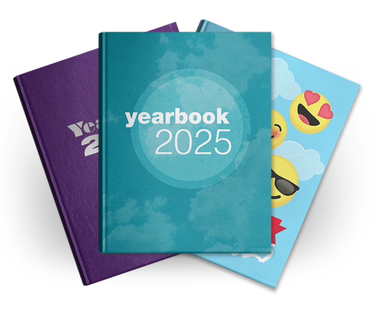

  A brief analysis of what coding patterns are using comparisons to your standard highschool yearbook.

&emsp;A fun fact about me that I don't get to bring up often is that back in highschool, I got to work on my school's yearbook during my Freshman to Junior years. My experiences with these projects were extremely fun, and extremely stressful. However, they would be pivotal to my general understanding of design, albeit in a more creative way. This may seem extremely tangential to the topic of coding, but I bring it up for an important reason. This past week, I learned how to build apps using Next.js, and some of the procedures that were done to tailor our templates to what we're looking to build were almost reminiscent of my time during yearbook, especially regarding how we went about our approach to design.

## Design parallels between Yearbook and Coding
&emsp;When creating a yearbook, it's obvious that the first thing that is decided on is theming. This is important, because ultimately it determines what aesthetics you're aiming for, what fonts you're going to use, and what color palette you're going to use. Through establishing this fundamental information, you can then refer to this information later on down the road, when you're stumped on what you want to do to design a page (think stuff like the superlatives, the trends pages - basically anything that isn't just a portrait page). All of this offers a fundamental framework that you can then build off to be able to make the yearbook more cohesive and fun.

&emsp;This process, to me, is almost exactly what programming using coding patterns are like. There is a difference in that of course Next.js is just a template, while yearbooks are created almost entirely from scratch, but it's the idea that remains constant throughout the process of it. Next.js's template is essentially your yearbook's theme that has already been decided on your behalf, and it's what you refer to when changing up the site to fit your needs. This is due to the fact that both the template and the theming will fill in whatever gaps are present when you start to design/code your yearbook/website. And because they fill the gaps in, they allow you to be able to progress faster through the work required for them, compared to if there was absolutely no template (or no theme in the context of yearbooks).
